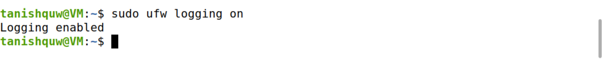
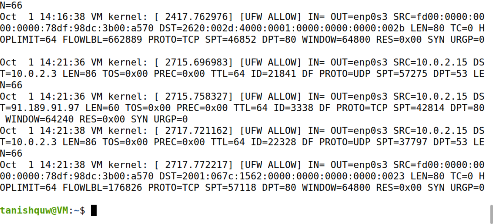
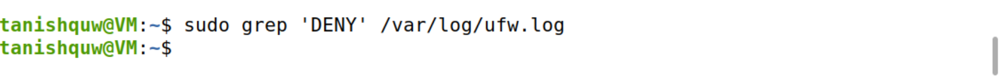

# Exploring Ubuntu Firewall (UFW)

This document is part of my **Network Security Home Lab** series.
Here I document the commands, screenshots, and findings while configuring and testing the UFW firewall on my Ubuntu server, focusing on rule management, logging, and overall network security posture.

---

## Steps Covered
## 1. Check UFW Status
**Commands used:**
`sudo ufw status`

### Purpose:  
To verify whether UFW is active or inactive before making changes.  

### Tool Explanation:  
`ufw status` shows the current firewall status and any active rules.  

### Observation:  
The output said “inactive,” so at this point the firewall wasn’t running yet.   

---

## 2. Allow SSH Before Enabling Firewall  
**Command used:**
`sudo ufw allow 22/tcp`

### Purpose:  
Ensures that enabling the firewall does not block remote SSH access.  

### Tool Explanation:  
The `allow` option adds a rule to permit traffic on the specified port (22/tcp).  

### Observation:  
The rule for port 22 got added. Now I know I won’t get locked out of SSH when I turn the firewall on.

> **Question:** Why do you need to allow port 22 before enabling UFW?  
> **Answer:** If I didn’t open port 22 first, the firewall would block SSH as soon as I enabled it, and I’d lose my remote access.

---

## 3. Identify Listening Services  
**Command used:**  
`sudo ss -tuln`

### Purpose:  
Lists all services currently listening on TCP and UDP ports.  

### Tool Explanation:  
- `ss` = socket statistics tool.  
- `-t` = TCP, `-u` = UDP, `-l` = listening, `-n` = numeric ports.  

### Observation:  
I could see ports like 22 (SSH), 21 (FTP), 23 (Telnet), and 631 (printing). SSH is expected, but FTP and Telnet shouldn’t really be running since they’re insecure.

---

## 4. Enable UFW  
**Command used:** 
`sudo ufw enable`

### Purpose:  
Activates the firewall so that rules are enforced.  

### Observation:  
UFW got enabled successfully, and it even said it will stay active on startup.

---

## 5. Verify UFW Status Again  
**Command used:**  
`sudo ufw status`

### Purpose:  
To confirm that UFW is active and rules are applied.  

### Observation:  
The firewall showed as active, and only SSH (22/tcp) was allowed so far.

---

## 6. Allow Web Server Ports  
**Commands used:**
`sudo ufw allow 80/tcp`
`sudo ufw allow 443/tcp`

### Purpose:  
Opens HTTP (80) and HTTPS (443) ports for web server access.  

### Tool Explanation:  
These are standard web service ports used by browsers to connect to servers.  

### Observation:  
After adding the rules, ports 80 (HTTP) and 443 (HTTPS) showed up as allowed. That’s what a web server would need to be reachable.

> **Question:** If this is a web server, what ports do you need to open?  
> **Answer:** I’d need to open port 80 for normal web traffic and 443 for HTTPS. Without those, no one could actually load a website on this server.

---

## 7. Show Verbose Firewall Status  
**Command used:**  
`sudo ufw status verbose`

### Purpose:  
Displays default policies, logging state, and all active rules.  

### Observation:  
The verbose output confirmed the defaults (deny incoming, allow outgoing). It also showed that logging was currently set to low, which I later changed to high in the next step. The rules I added (SSH, HTTP, HTTPS) were all listed correctly.

---

## 8. Block a Hostile IP  
**Command used:**
`sudo ufw deny from 10.0.0.0`

### Purpose:  
Blocks traffic from a specific untrusted IP address.  

### Observation:  
The deny rule for 10.0.0.0 was added, so any traffic from that address will now be blocked.

---

## 9. Allow Specific Host to Port 587  
**Command used:** 
`sudo ufw allow from 192.168.1.50 to any port 587 proto tcp`  

### Purpose:  
Allows only a trusted host to access mail submission service (SMTP on port 587).  

### Tool Explanation:  
Port 587 is used for **SMTP submission** by mail clients.  

### Observation:  
The rule went through — now only 192.168.1.50 can connect to port 587. That’s good because port 587 is for email submission and shouldn’t be open to everyone.

> **Question:** What is port 587 used for?  
> **Answer:** Port 587 is the submission port for email. It’s what mail clients use to send outgoing mail to a mail server. That’s why I only allowed one trusted IP to use it.

---
## 10. List Numbered Rules  
**Command used:**  
`sudo ufw status numbered`

### Purpose:  
Shows rules with index numbers for easy deletion or modification.  

### Observation:  
All my rules were listed with numbers. This would make it easier to delete or adjust one rule later if I needed to.

---

# II. Enable UFW Logging

## 1. Enable UFW Logging  
**Command used:** 
`sudo ufw logging on`

### Purpose:  
Enables firewall logging for monitoring and troubleshooting.  

### Observation:  
The system confirmed logging was on, so now firewall activity will get recorded in `/var/log/ufw.log`.

---

## 2. Set Logging Level to High  
**Command used:**  

`sudo ufw logging high`

### Purpose:  
Provides detailed logging of both allowed and denied traffic.  

### Tool Explanation:  
- Low → minimal logs.  
- Medium → some detail.  
- High → detailed info on blocked/allowed packets.  
- Full → very verbose, includes kernel logs.  

### Observation:  
The logging level switched to high, which means I’ll get more detailed info about traffic.

---

## 3. Monitor Logs in Real-Time  
**Command used:**  

`sudo tail -f /var/log/ufw.log`

### Purpose:  
To view live firewall log activity.  

### Observation:  
While watching the log file, I could see live entries showing source/destination IPs and ports. I stopped it with CTRL+C after checking a few entries.

---

## 4. Filter Logs for Allowed and Denied Traffic  
**Commands used:**  

`sudo grep 'ALLOW' /var/log/ufw.log`
`sudo grep 'DENY' /var/log/ufw.log`

### Purpose:  
Filters log entries to show only allowed or denied packets.  

### Observation:  
- The `ALLOW` filter showed entries for allowed traffic.

- The `DENY` filter didn’t return anything, which makes sense since nothing actually tried to connect on a blocked port while I was testing.

> **Q:** Is there any output for DENY? Why or why not?  
> **A:** I didn’t see any DENY entries, which makes sense — nothing tried to connect on a blocked port while I was testing.

---

## Conclusion  

In this assignment, I set up and tested the **UFW firewall** on my Ubuntu server. I turned the firewall on, allowed the services I needed (SSH, HTTP, HTTPS), and added some restrictions like blocking a test IP and only letting one trusted host use port 587 for email. 

I then enabled logging at a high level and watched the log file in real-time to see how traffic was being recorded. Filtering the logs showed plenty of allowed traffic but no denied entries, which made sense since nothing tried to hit a blocked port during my testing. 

Overall, this lab gave me a clear understanding of how UFW rules work and how logging can help track what’s happening on the network. It showed me the importance of only opening what’s necessary and keeping an eye on firewall activity.

---
