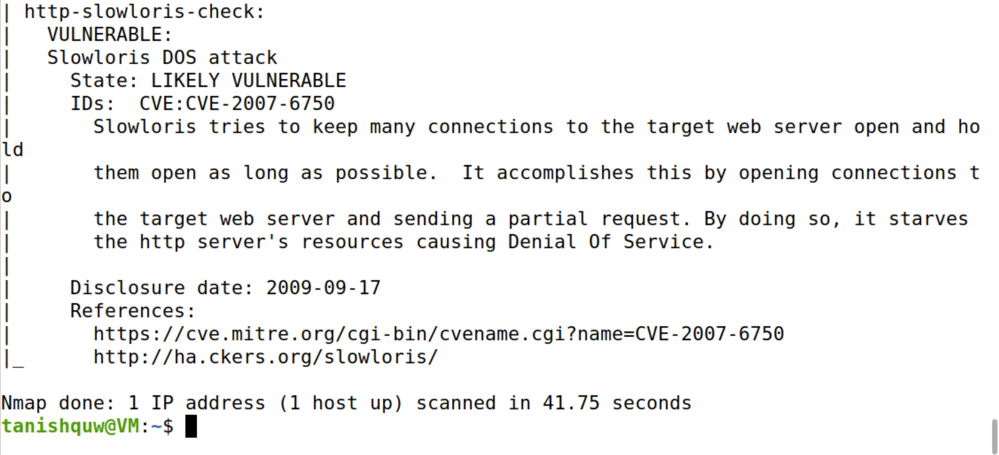

# Exploring Ubuntu Home Lab

This document is part of my **Network Security Home Lab** series.  
Here I document commands, screenshots, and findings while exploring my Ubuntu server’s network configuration and security posture.  

---

## Steps Covered
## 1. Identify Network Interfaces and IP Addresses  
**Commands used:**
`ifconfig`

### Purpose: 
This command displays all network interfaces and their associated IP addresses
on your server. Knowing which interfaces are active and their IP addresses helps you
understand your server's network configuration.

### Tool Explanation: 
ip a and ifconfig are utilities that provide detailed information about
network interfaces, including their status (up or down), IP addresses, and more.

### Observation:
I was able to see two network interfaces — the loopback (lo) and the main adapter (enp0s3). The main adapter had an IP address, which confirmed that my VM is properly connected to the local network.

## 2. Check Open Ports  
**Commands used:**
`sudo ss -tuln`

### Purpose:
Lists all open ports on the server along with the services listening on them. This
helps you identify unnecessary open ports that could be potential entry points for attackers.

### Tool Explanation:
netstat and ss show network connections, routing tables, interface
statistics, masquerade connections, and multicast memberships. The -tuln options restrict
the output to show only TCP (t) and UDP (u) ports in listening (l) state without resolving
names (n).

### Observation:
The scan showed that SSH (22) was open, which is normal. But I also noticed FTP (21), Telnet (23), and printing service (631) running. FTP and Telnet are outdated and not safe to use, so these shouldn’t really be active.

## 3. Analyze Network Connections  
**Commands used:**
`sudo lsof -i -P -n`

### Purpose:
Lists all open network connections, which can help you identify unexpected or
unauthorized connections to your server.

### Tool Explanation:
lsof stands for 'list open files'. With the -i flag, it lists all network files,
including their associated processes. The -P and -n flags prevent the resolution of port
numbers and IP addresses, making the output easier to read and faster to generate.

### Observation:
This step listed which programs were using the ports. SSH was linked to port 22, FTP to 21, and Telnet to 23. It matched the earlier results and confirmed that some unnecessary services are running in the background.

## 4. Perform Network Scanning with Nmap
**Commands used:**
`sudo nmap -sS -O localhost`

### Purpose:
Scans your server to identify open ports, running services, and the operating
system. This can help you discover services that are unintentionally exposed.

### Tool Explanation:
Nmap (Network Mapper) is a powerful network scanning tool used to
discover hosts and services on a network. The -sS option performs a stealth TCP SYN
scan, and -O attempts to determine the operating system of the target.

### Observation:
Nmap confirmed the same open ports (21, 22, 23, 631). It also detected that the system is Linux. Again, it pointed out FTP and Telnet, which are not secure and should be disabled.
  
## 5. Check for Devices on the Local Network 
**Commands used:**
`sudo nmap -sP 192.168.1.0/24`

### Purpose:
Identifies all live hosts on your local network. This helps you understand the
devices present in your network and ensures there are no unauthorized devices connected.

### Tool Explanation:
The -sP option in Nmap is a Ping Scan, which discovers which hosts on
a network are up without performing a port scan.

### Observation:
The scan picked up multiple devices on my subnet, including my VM and the router. This showed that my VM is not isolated and is sharing the same network with other systems.

## 6. Check Services and Versions 
**Commands used:**
`sudo nmap -sV localhost`

### Purpose:
Scans for open ports and attempts to determine the service and version running
on each port. This helps identify outdated or vulnerable software that might need updating.

### Tool Explanation:
The -sV option in Nmap enables version detection, providing detailed
information about the services running on open ports.

### Observation:
Nmap displayed the specific software running on the open ports, such as OpenSSH for SSH and vsftpd for FTP. Seeing FTP and Telnet here confirmed again that these insecure services are available and should ideally be turned off.

## 7. Identify Potential Vulnerabilities 
**Commands used:**
`sudo nmap --script vuln localhost`

### Purpose:
Uses Nmap's vulnerability scanning scripts to identify known vulnerabilities on the
server. This step is useful for finding common security issues in installed software.

### Tool Explanation:
Nmap has a scripting engine that allows for a wide range of scans. The -
-script vuln option runs scripts that check for various vulnerabilities.

### Observation:
The vulnerability scan tried many scripts. Some of them didn’t work, but one check showed possible admin folders. No critical issues were found, but it reminded me that vulnerability results always need careful review.

## 8. Inspect Network Traffic  
**Commands used:**
# Tried default eth0, but found correct interface with:
`ip link show`
# Captured 50 packets on enp0s3:
`sudo tcpdump -i enp0s3 -nn -c 50`

### Purpose:
Monitors network traffic on a specific interface (e.g., eth0). This is helpful to
observe real-time traffic and detect suspicious activities or anomalies.

### Tool Explanation:
tcpdump is a packet analyzer that captures and displays packet headers
of network traffic passing through a specified interface.

### Observation:
With tcpdump, I captured live packets moving on the network. I saw ARP requests and replies, which showed how devices communicate and discover each other on the local network.

## 9. Monitor Network Connections in Real-Time
**Commands used:**
`sudo watch -n 1 netstat -tulnp`  

### Purpose: 
Continuously monitors network connections, updating every second (-n 1). This
helps in real-time observation of network activities, such as new connections or services
starting.

### Tool Explanation:
Watch runs a specified command at regular intervals. In this case, it runs
netstat to keep you updated about network connections in real time.

### Observation:
Using the watch command, I could monitor connections updating every second. The same services — FTP, SSH, Telnet, and printing — kept showing up. There were no new or unexpected services.

## 10. Check Firewall Rules  
**Command used:**
`sudo ufw status verbose`

### Purpose:
Displays the current firewall rules configured on your server, showing which ports
and services are allowed or blocked. This helps ensure that only necessary ports are open.

### Tool Explanation:
ufw (Uncomplicated Firewall) is a front-end for managing iptables,
designed to make it easier to configure a firewall. The status verbose option provides a
detailed view of the current firewall configuration.

### Observation:
The output showed that the firewall was disabled. This means all traffic was allowed without restrictions. In a real-world setup, it’s much safer to enable the firewall and allow only necessary services like SSH.

---