# SIEM and IDPS Lab

This document is part of my **Network Security Home Lab** series.  
In this section, I walk through the setup and understanding of a lightweight **Security Information and Event Management (SIEM)** and **Intrusion Detection/Prevention System (IDPS)** using a combination of modern open-source tools.

To build and understand a Security Information and Event Management (SIEM) and Intrusion Detection/Prevention System (IDPS) using:
- **Suricata** (for detecting alerts)
- **Loki** (for log storage)
- **Promtail** (for log shipping)
- **LogCLI** (for querying logs)
- **Docker** (for containerizing Loki and Promtail)

---

## Part 1 – Prepare System

### Install basic tools
```bash
sudo apt update && sudo apt upgrade -y
sudo apt -y install curl jq unzip
```
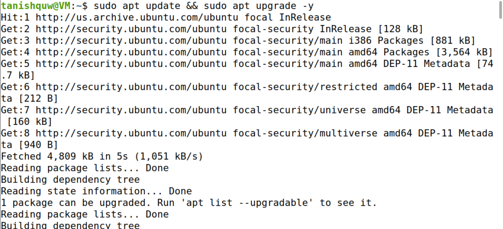
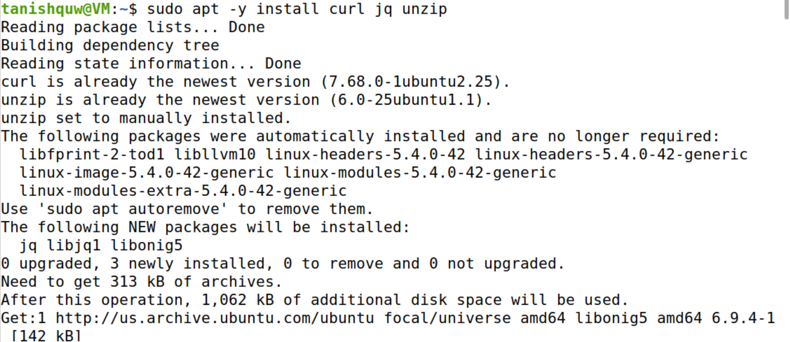

**Purpose:**  

To make sure my system is up to date and has the necessary tools installed. This helps avoid issues with outdated packages and prepares the system for tasks that involve downloading files, handling JSON, or working with zip archives.

**Tools Explanation:** 

**`sudo apt update`** checks for the latest available package versions.

**`sudo apt upgrade -y`** upgrades all installed packages automatically.

**`sudo apt -y install curl jq unzip`** installs useful tools:

**`curl`** is used to fetch or send data from URLs.

**`jq`** helps process and read JSON data in the terminal.

**`unzip`** is for extracting files from .zip archives. 

**Observation:**

The system pulled updates successfully, and I noticed that one package could still be upgraded manually. While curl and unzip were already installed, jq was not, so it was added along with a couple of supporting libraries. It also showed that some older kernel packages are no longer needed, and suggested using autoremove to clean them up.

---

## Install Docker
```bash
curl -fsSL https://get.docker.com | sudo sh
sudo usermod -aG docker "$USER"
newgrp docker
```
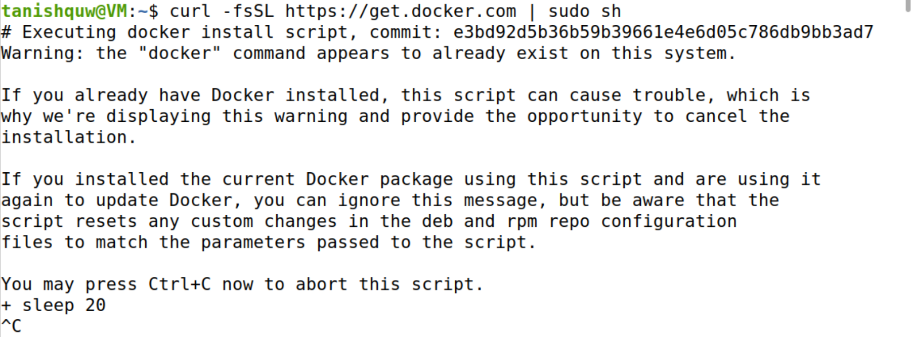
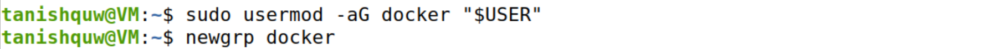

**Purpose:**  

To install Docker on my system and configure it so that I can use Docker commands without needing to prepend sudo every time. This setup is useful for managing containers more efficiently as a non-root user.

**Tools Explanation:**

**`curl -fsSL https://get.docker.com | sudo sh`**
This command downloads and runs Docker’s official installation script. It checks whether Docker is already installed and warns if a version is detected.

**`sudo usermod -aG docker "$USER"`**
Adds the current user to the docker group, which allows running Docker without sudo.

**`newgrp docker`**
Refreshes the group membership for the current session so that the change from the above command takes effect immediately.

**Observation:**

When I ran the installation script, it detected that Docker was already present, so it issued a warning instead of proceeding with a fresh install. I canceled the script manually using Ctrl+C to avoid overwriting any existing configuration. After that, I added my user to the Docker group and used newgrp docker to apply the change without needing to reboot or log out.

```bash
sudo systemctl enable --now docker
docker --version
```
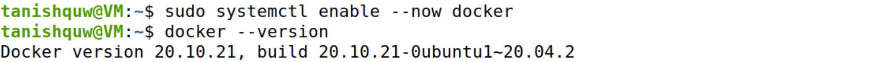

**Purpose:**  

Enable Docker as a system service and check its version to confirm everything is working correctly.

**Tools Explanation:**

**`sudo systemctl enable --now docker`**
This enables Docker to start on boot and also starts the service immediately.

**`docker --version`**
Verifies the installed Docker version to ensure the setup is complete.

**Observation:**

The Docker service started successfully, and the version output confirmed that Docker 20.10.21 was installed correctly on my Ubuntu 20.04.2 system. Everything seems to be running as expected.

---

## Part 2 – Suricata Setup

### Install and update Suricata
```bash
sudo apt -y install suricata
sudo apt -y install suricata-update
sudo suricata-update
```
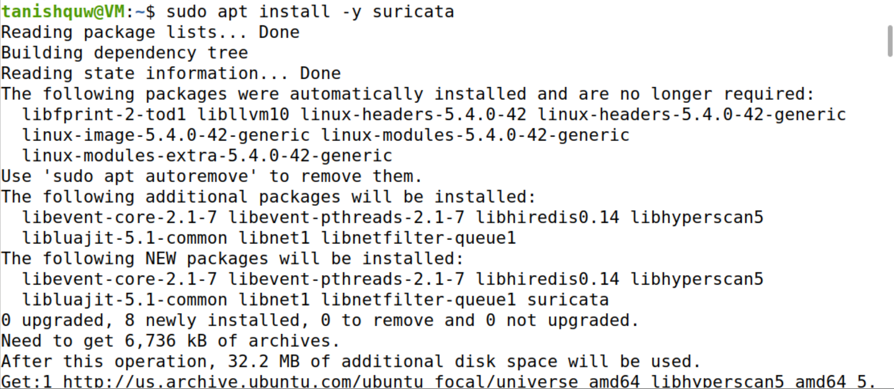
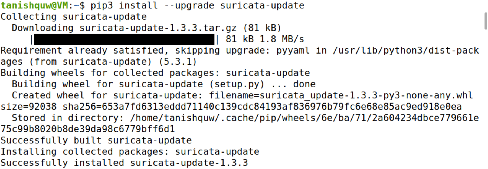
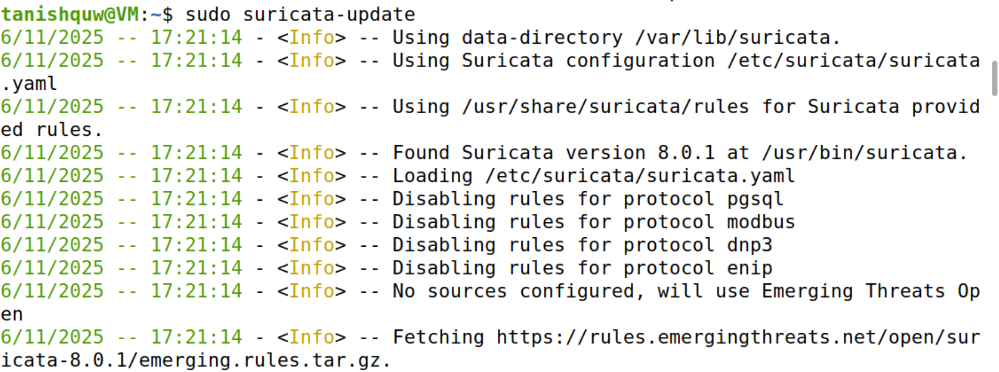
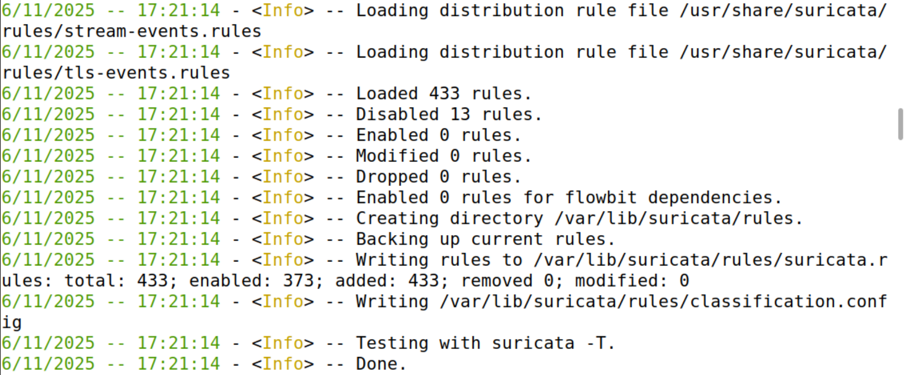

**Purpose:**  

To install Suricata, an open-source intrusion detection and prevention engine, and update it with the latest threat detection rules. Keeping the rules up to date ensures the system can detect and respond to emerging network threats effectively.

**Tools Explanation:**

**`sudo apt -y install suricata`**
Installs the Suricata engine and its dependencies. Suricata is responsible for monitoring network traffic in real-time and generating alerts based on predefined rules.

**`pip3 install --upgrade suricata-update`**
Installs or upgrades the suricata-update tool using Python's package manager. This tool is used to fetch and manage rule sets that Suricata uses to identify suspicious activity.

**`sudo suricata-update`**
Runs the update process, pulling the latest rules. It disables unused protocol rules and configures Suricata to use the most current detection logic.

**Observation:**

The Suricata package was successfully installed along with all necessary libraries. I then used pip to upgrade suricata-update to the latest version (1.3.3), which completed without errors.
Running sudo suricata-update confirmed that Suricata version 8.0.1 was detected and working. The updater pulled in rules from Emerging Threats, loaded 433 rules, and wrote them to the correct directory.


### Identify active network interface
```bash
ip -br a | awk '$1!="lo"{print $1, $3}'
```
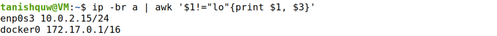

**Purpose:**  

To quickly find out which network interface on my system is actively being used so I can configure Suricata to listen on the correct interface for packet capture.

**Tools Explanation:**

**`ip -br a`**
Shows all network interfaces in a brief and clean format, making it easier to read compared to the full ip a output.

**`awk '$1!="lo"{print $1, $3}'`**
Filters out the loopback interface (lo) and prints only the interface name and its assigned IP address. This helps focus on the interfaces actually connected to the network.

**Observation:**

The output showed two active interfaces:

**`enp0s3`** with the IP **`10.0.2.15/24`** — this is the main interface assigned by my VM’s NAT network.

**`docker0`** with IP **`172.17.0.1/16`** — created by Docker’s networking system.

For Suricata, I’ll be using enp0s3 since it’s the interface handling real external traffic.

### Setup custom rules directory
```bash
sudo mkdir -p /etc/suricata/rules
sudo touch /etc/suricata/rules/local.rules
```
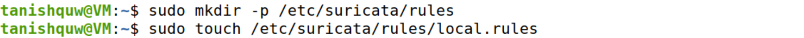

**Purpose:**  

To prepare a location for writing and storing custom Suricata rules. This allows me to define my own detection logic tailored to specific threats or traffic patterns I want to monitor in my network.

**Tools Explanation:**

**`sudo mkdir -p /etc/suricata/rules`**
Creates the directory path for storing Suricata rules. The -p flag ensures that any missing parent directories are also created without throwing an error.

**`sudo touch /etc/suricata/rules/local.rules`**
Creates an empty file named local.rules where I can add my own custom detection signatures. This file will later be referenced in Suricata’s configuration to include these rules during packet inspection.

**Observation:**

The command ran successfully, creating both the **`rules`** directory and the **`local.rules`** file. With this setup in place, I’m now ready to begin writing custom Suricata rules and have them loaded into the engine for traffic analysis.

### Edit Suricata config
```bash
sudo nano /etc/suricata/suricata.yaml
```

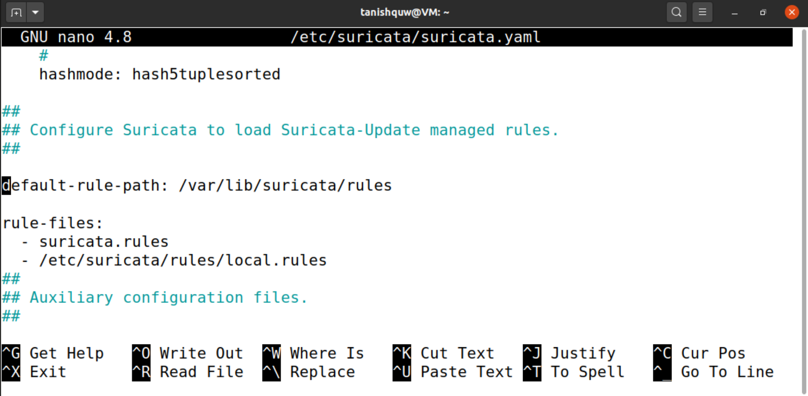
**Purpose:**  

To configure Suricata so it loads the correct rule paths, including the custom local.rules file I created earlier. This ensures my personal detection rules are applied during traffic analysis. It also allows Suricata to monitor traffic on the correct network interface.

**Tools Explanation:**

**`sudo nano /etc/suricata/suricata.yaml`**
Opens the main Suricata configuration file in the terminal using the Nano text editor with elevated permissions, allowing changes to be made and saved.

Inside the file, I made the following key changes:
1. Set the default rule path:
    **`default-rule-path: /var/lib/suricata/rules`**
     This tells Suricata where to look for downloaded rules.
2. Included this in local custom rule file:
    **`rule-files:`**
    **`- suricata.rules`**
    **`- /etc/suricata/rules/local.rules`**

**Observation:**

The configuration file already had placeholders for rule paths, so it was easy to append my custom rule file. Suricata is now ready to use both the standard and custom detection rules during operation.
    

### Test Suricata configuration
```bash
sudo suricata -T -c /etc/suricata/suricata.yaml -v
suricata - update --help

```
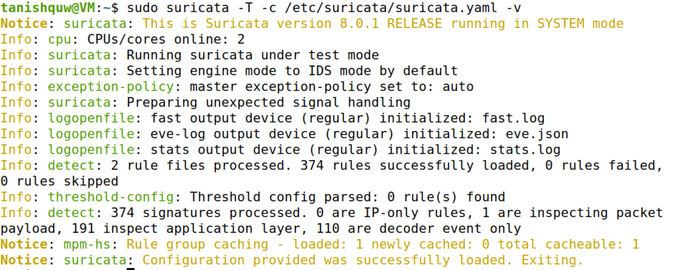
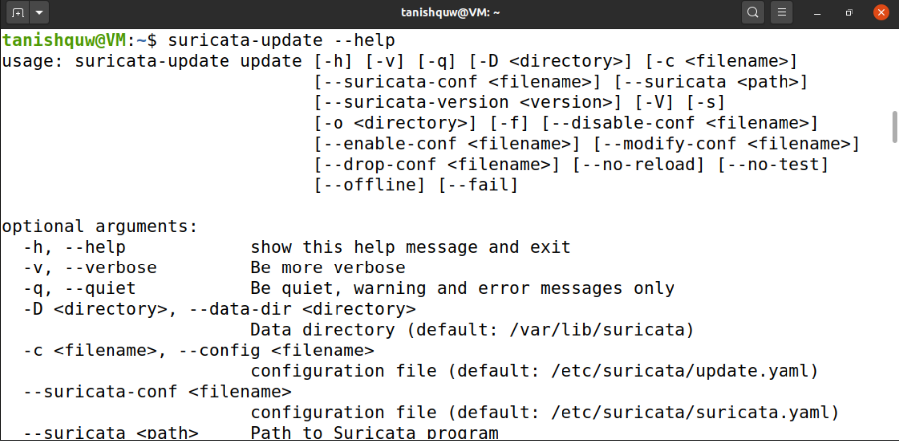
**Purpose:**  

I used this step to make sure my Suricata configuration file was set up properly and that all the rule files could be loaded without issues. This validation is important because it checks for any mistakes in the YAML file or rule syntax before actually running Suricata on live traffic. I also explored the **`suricata-update`** help command to understand how rule updates are managed.

**Tools Explanation:**

The command **`sudo suricata -T -c /etc/suricata/suricata.yaml -v`** runs Suricata in test mode (**`-T`**) to validate the config and rule files without starting traffic monitoring. The **`-c`** flag specifies the config file to use, and **`-v`** enables verbose output for more detailed feedback. This helps catch setup issues early. Running **`suricata-update --help`** shows available options for managing rules, like **`-D`** to set a custom data directory, **`--enable-conf`/`--disable-conf`** to control rule sources, and **`--offline`** for updating rules without internet — useful for customizing rule updates.

**Observation:**

When I ran the Suricata test, it processed 2 rule files and successfully loaded all 374 rules with no errors or skips. The logs like **`fast.log`**, **`eve.json`**, and **`stats.log`** were also initialized, which confirmed that Suricata is ready to run with the current configuration.

The **`suricata-update --help`** command displayed the full list of options, confirming that the update tool is working correctly and ready to fetch new rules or modify existing ones.

With this step done, my Suricata setup is now fully validated and ready to monitor traffic safely.

### Question: Explain what the `-T`, `-c`, and `-v` flags do in the command above.
**Answer:**  
The `-T` flag runs Suricata in test mode, which means it doesn’t actually start the IDS engine but only checks whether the configuration and rule files are valid.
The `-c` flag is used to specify which configuration file Suricata should load — in this case, `/etc/suricata/suricata.yaml`. 
The `-v` flag enables verbose mode, allowing Suricata to display more detailed output during the test, making it easier to understand what’s happening and spot any issues.

### Run Suricata
```bash
sudo systemctl stop suricata
sudo suricata -i $(ip -br a | awk '$1!="lo"{print $1; exit}') -D
```
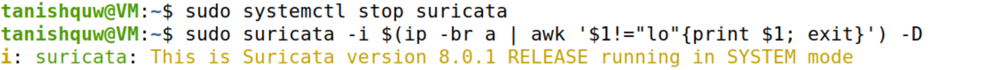

**Purpose:** 

The goal of this step was to manually launch Suricata in daemon mode so it could start analyzing real-time network traffic. Before running it manually, I had to stop the service-based version to avoid conflicts — since Suricata can't run in two places at once using the same interface.

**Tools Explanation:**

**`sudo systemctl stop suricata`**

This command stops the Suricata service if it’s already running in the background as a system-managed service. It’s important to stop it first to prevent interface binding conflicts when launching Suricata manually.

**`sudo suricata -i $(ip -br a | awk '$1!="lo"{print $1; exit}') -D`**

**`-i`** specifies which interface Suricata should listen on. The expression inside **`$(...)`** uses **`ip -br a`** and **`awk`** to automatically grab the first active network interface that is not the loopback interface.

**`-D`** runs Suricata in daemon mode — meaning it runs in the background instead of taking over the terminal session.

This dynamic method ensures that Suricata attaches to the correct interface without having to hardcode the name, making the setup more portable.

**Observation:**

Suricata started successfully in SYSTEM mode with version 8.0.1. There were no errors shown, confirming that it picked the right interface and launched in the background as expected. At this point, Suricata was actively listening and ready to analyze traffic in real time.

### View live logs
```bash
sudo tail -f /var/log/suricata/eve.json | jq .
sudo jq . /var/log/suricata/eve.json
```
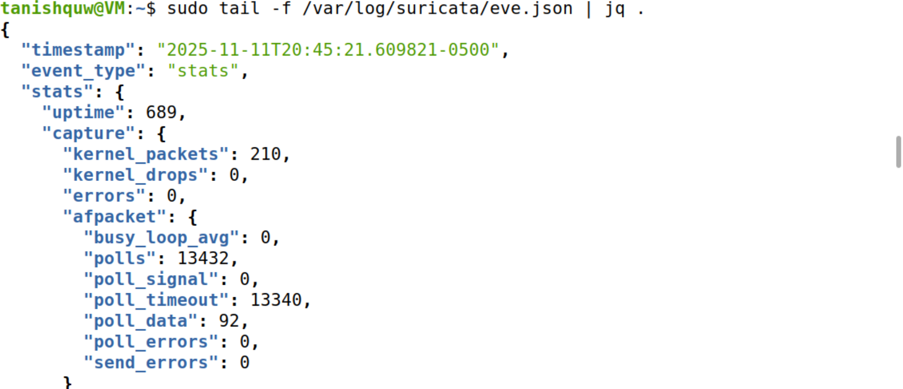
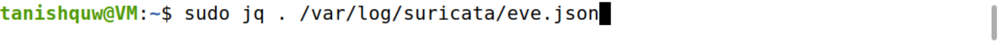
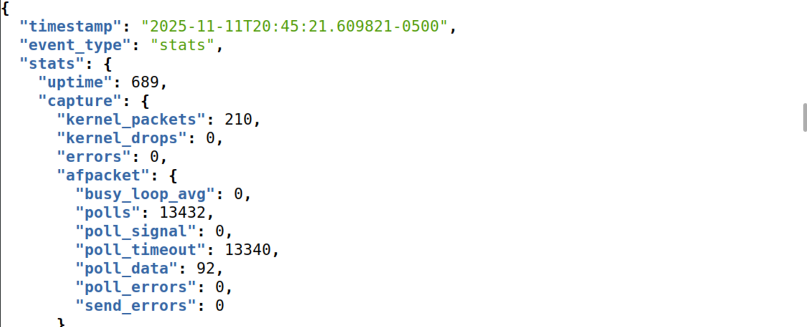

**Purpose:**  

Both commands are used to inspect Suricata's log data stored in **`eve.json`**, but they serve slightly different use cases.

  The first one is ideal for live monitoring — it streams logs in real-time as Suricata generates them.

  The second is for static viewing — it shows the entire current content of the log file in a nicely formatted JSON view.

**Tools Explanation:**

**`sudo tail -f /var/log/suricata/eve.json | jq .`**
Continuously outputs new logs as they are written to the file, with jq making the JSON output clean and readable. Perfect when I want to watch events unfold live.

**`sudo jq . /var/log/suricata/eve.json`**
Displays the full log file's content all at once in a structured JSON format. Helpful for reviewing logs after Suricata has been running for a while.

**Observation:**

Using both methods, I could comfortably examine Suricata's event logs. The live stream was useful while testing packet captures or rule triggers, and the static view helped me do a detailed review later. Having structured JSON logs made everything much easier to interpret.

---

## Part 3 – Loki Setup

### Create Loki directories
```bash
sudo mkdir -p /etc/loki /var/lib/loki/{chunks,rules}
```
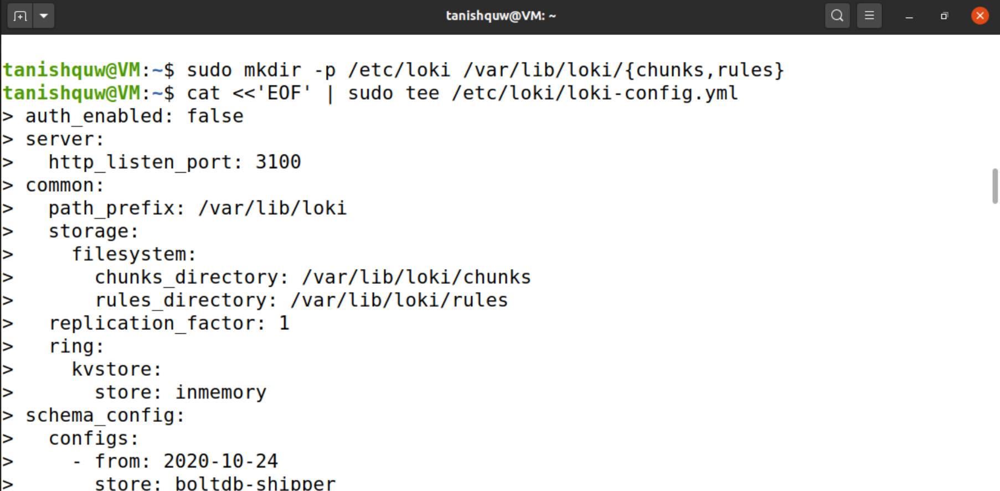
**Purpose:**  

Before running Loki, I needed to set up proper directories for both its configuration and data storage. The **`/etc/loki`** directory is where the main configuration file will live, and the two folders under **`/var/lib/loki/`** — **`chunks`** and **`rules`** — are where Loki stores actual log data and rule sets.  

**Tools Explanation:**

**`sudo mkdir -p /etc/loki`**: This makes sure the config directory exists.

**`/var/lib/loki/{chunks,rules}`**: Creates two subdirectories (**`chunks`** and **`rules`**) inside Loki’s data path.

The **`-p`** flag ensures that all parent directories are created if they don't already exist, and avoids errors if they do.

**Observation:**

The command ran successfully, and now Loki has its necessary folder structure in place. I can proceed with writing the config file (**`loki-config.yml`**) and running Loki.

### Create Loki configuration
```bash
cat <<'EOF' | sudo tee /etc/loki/loki-config.yml
auth_enabled: false
server:
  http_listen_port: 3100
common:
  path_prefix: /var/lib/loki
  storage:
    filesystem:
      chunks_directory: /var/lib/loki/chunks
      rules_directory: /var/lib/loki/rules
  replication_factor: 1
  ring:
    kvstore:
      store: inmemory
schema_config:
  configs:
    - from: 2020-10-24
      store: boltdb-shipper
      object_store: filesystem
      schema: v13
      index:
        prefix: index_
        period: 24h
EOF
```

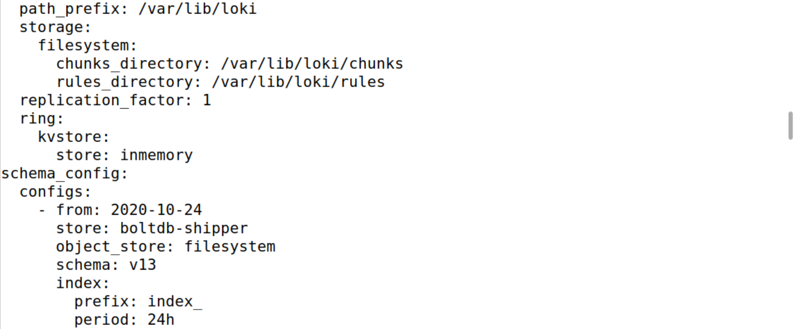

**Purpose:**  

The aim here was to set up Loki’s main configuration file so it can properly start, store logs, and make them searchable. I defined where Loki should keep its data (like log chunks and rules), which port it should listen on, and how it handles indexing and schema. This config ensures that everything is organized and Loki runs smoothly using local storage.

**Tools Explanation:**

I used the cat **`<<'EOF' | sudo tee /etc/loki/loki-config.yml`** command to quickly create Loki’s main config file. This method let me write a bunch of lines at once into the file without opening a text editor. It was an easy way to define all Loki settings like storage paths, port number, and how logs are indexed—all in one go.

**Observation:**

The config file was successfully created under **`/etc/loki/loki-config.yml`**. No errors were thrown, and the content matched what I intended. Now Loki is ready to start using this configuration, and it should be able to store logs and make them searchable based on the schema I defined.

### Set permissions for Loki
```bash
sudo chown -R 10001:10001 /var/lib/loki
sudo chmod -R u+rwX /var/lib/loki
```
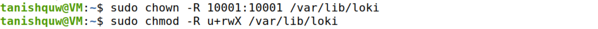
**Purpose:**  

Make sure Loki can properly read from and write to its log and config directories inside the container. Without this step, it might crash or fail to start due to lack of access.

**Tools Explanation:**

I used **`chown`** to change the ownership of the Loki data directory to the user ID 10001, which Loki runs as inside its container. Then, with **`chmod`**, I made sure the user has read, write, and execute permissions where needed. This way, Loki won’t run into permission issues when trying to store or access logs.

**Observation:**

After applying the ownership and permission changes, the commands ran without any errors. This confirms that the Loki directories are now accessible to the Loki service user (10001). With the corrected permissions in place, Loki will be able to create chunks, write rule files, and manage its storage without running into permission‑denied issues later on.

### Run Loki container
```bash
sudo docker run -d --name loki -p 3100:3100   -v /etc/loki:/etc/loki   -v /var/lib/loki:/var/lib/loki   grafana/loki:2.9.8 -config.file=/etc/loki/loki-config.yml
```
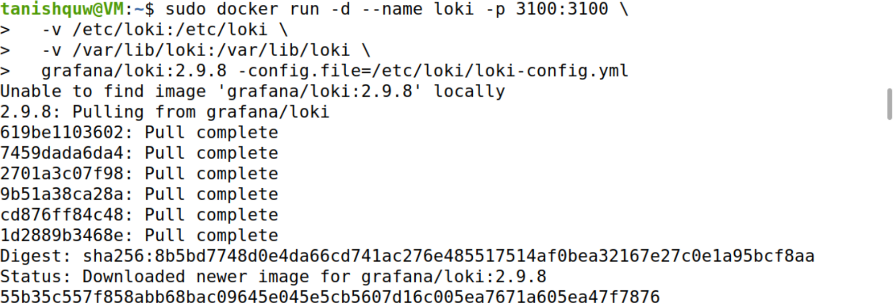
**Purpose:**  

Start Loki as a Docker container and load it with the configuration file I created earlier. This step brings Loki online so it can start accepting and storing logs.

**Tools Explanation:**

I used the **`docker run`** command to start the Loki container in the background. The **`-p`** option makes Loki available on port 3100, while the **`-v`** flags link the local config and data directories with the container. Finally, I pointed it to the custom config file to make sure Loki runs with the correct setup.

**Observation:**

The Docker command ran smoothly, and the Loki image was pulled automatically since it wasn’t already present locally. After the image layers downloaded and the container started, Loki began running in the background with the correct configuration and storage paths. This confirms the setup is working and ready for log ingestion.

### Verify Loki readiness
```bash
curl -s http://localhost:3100/ready; echo
```
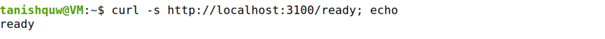
**Purpose:**  

The goal of this step is to quickly check whether Loki has started properly and is ready to handle requests. If Loki is running as expected, it should return the word “ready”, confirming that the service is up.

**Tools Explanation:**

I used **`curl`** here because it’s a simple way to send an HTTP request from the terminal. The **`-s`** flag hides extra output, so I only see the actual response. Adding **`echo`** just makes sure the output ends on a clean new line.

**Observation:**

The command returned “ready”, which tells me that Loki is active and responding correctly. This confirms that the container loaded the configuration and started without any issues.

---

## Part 4 – Promtail Setup

### Create directories
```bash
sudo mkdir -p /etc/promtail /var/lib/promtail
```
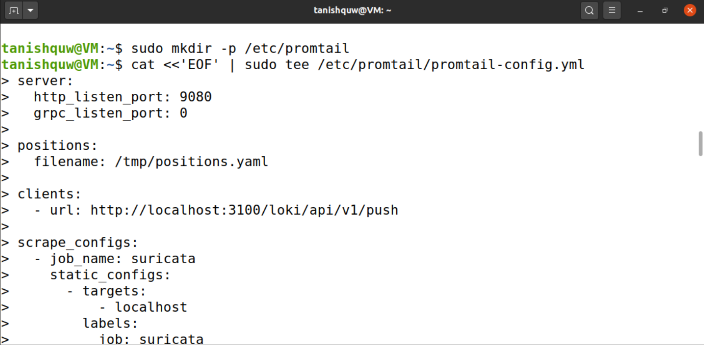
**Purpose:**  

This step is for setting up the configuration file that tells Promtail how and where to collect logs, and where to send them (in this case, to Loki).

**Tools Explanation:**

  **`mkdir`** creates the config folder for Promtail.

  **`cat <<'EOF' | sudo tee ...`** is a shortcut to write multiple lines into a config file.

**Observation:**

The **`/etc/promtail/promtail-config.yml`** file was successfully created with the desired Loki push configuration and Suricata job target. The structure looks valid and ready for Promtail to use.

### Configure Promtail
```bash
cat <<'EOF' | sudo tee /etc/promtail/promtail-config.yml
server:
  http_listen_port: 9080
  grpc_listen_port: 0
clients:
  - url: http://localhost:3100/loki/api/v1/push
positions:
  filename: /var/lib/promtail/positions.yaml
scrape_configs:
  - job_name: suricata
    static_configs:
      - targets: [localhost]
        labels:
          job: suricata
          __path__: /var/log/suricata/eve.json
EOF
```

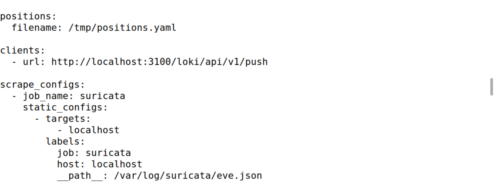
**Purpose:**  

This configuration allows Promtail to collect logs generated by Suricata and forward them to Loki for indexing and querying.

**Tools Explanation:**

**`Promtail`**: A lightweight log collector that reads log files and ships them to Loki.

**`Loki`**: A log aggregation system that stores and indexes logs, making them searchable in Grafana.

**Observation:**

The configuration specifies Loki as the destination (**`localhost:3100`**) and sets up Promtail to monitor **`/var/log/suricata/eve.json`**. It tags each log with relevant labels like **`job`**: **`suricata`** and **`host: localhost`**, enabling better filtering and visualization later in Grafana.

### Run Promtail container
```bash
sudo docker run -d --name promtail -p 9080:9080   -v /etc/promtail:/etc/promtail   -v /var/log/suricata:/var/log/suricata:ro   -v /var/lib/promtail:/var/lib/promtail   grafana/promtail:2.9.8   -config.file=/etc/promtail/promtail-config.yml
```
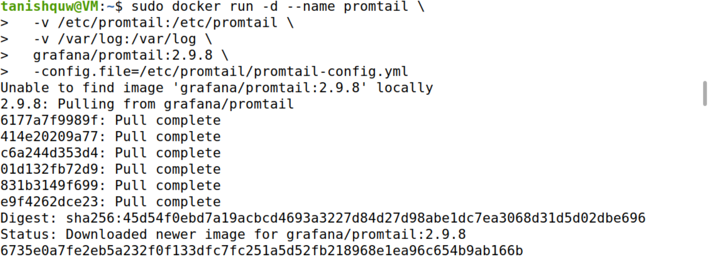
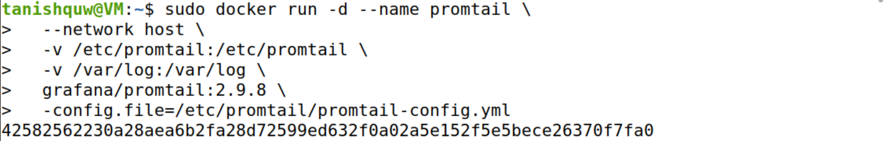
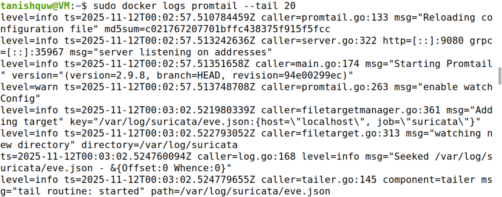
**Purpose:**  

Start the Promtail container to collect Suricata logs from the host system and forward them to Loki for central log aggregation and analysis.

**Tools Explanation:**

**`Docker`**: Used to run Promtail in an isolated container.

**`Volumes (-v)`**: Mount config and log directories so Promtail can access logs and configuration.

**`Port 9080`**: Allows Promtail web interface access for readiness checks.

**`Promtail image`**: Uses Grafana's official Promtail container (v2.9.8).

**`-config.file`**: Tells Promtail where to find its configuration file.

**Observation:**

The Promtail container pulled successfully from Docker Hub.

Promtail started without errors and began watching the specified Suricata log file:
**`/var/log/suricata/eve.json`**.

The tail routine initialized, confirming Promtail is reading the logs and is ready to ship them to Loki.

---

## Part 5 – Install LogCLI & Test Queries

### Install LogCLI
```bash
curl -L https://github.com/grafana/loki/releases/download/v2.9.8/logcli-linux-amd64.zip -o logcli.zip
unzip logcli.zip
chmod +x logcli-linux-amd64
sudo mv logcli-linux-amd64 /usr/local/bin/logcli
```
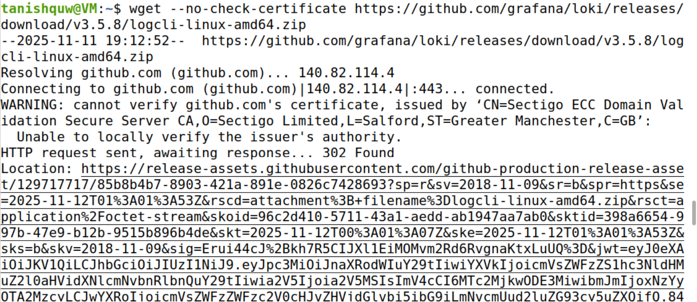
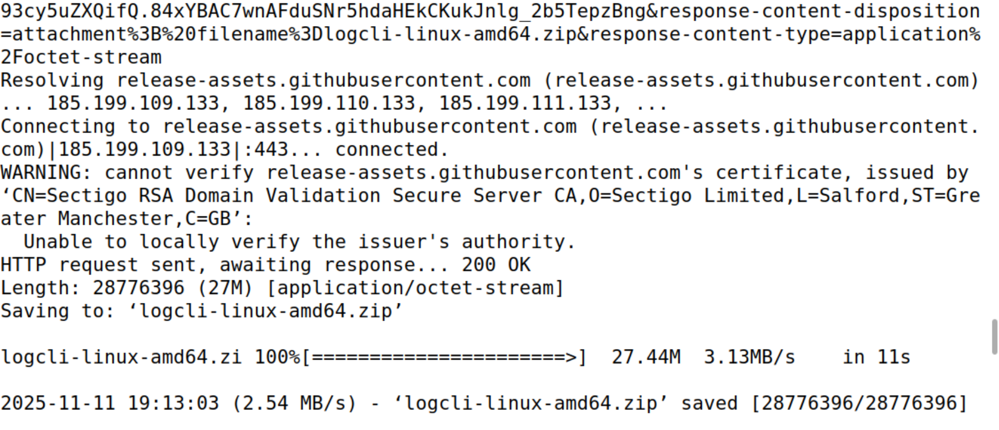
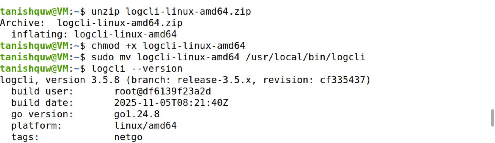
**Purpose:**  
To install and configure logcli, a command-line interface tool used to query logs from Grafana Loki. This tool allows users to interact with Loki from the terminal, making it easier to fetch and analyze logs without a GUI.

**Tools Explanation:**

To install **`logcli`**, a few basic Linux commands were used. The **`curl`** command fetched the compressed **`logcli`** file from the GitHub releases page. Then, **`unzip`** was used to extract the downloaded zip archive. After extraction, the **`chmod +x`** command made the binary executable, allowing it to be run as a program. The **`mv (move)`** command placed the binary into **`/usr/local/bin`** so that it can be accessed from any location in the terminal. Finally, running logcli **`--version`** confirmed that the installation was successful.

**Observation:**

The installation process of **`logcli`** completed successfully without any errors. The zip file was downloaded and extracted properly. Although a certificate warning appeared during the download, it did not stop the process. After giving the necessary permissions and moving the file to the appropriate directory, running the version check showed that **`logcli`** version 3.5.8 is now installed and ready to use for querying Loki logs from the command line.

### Test Loki connectivity
```bash
logcli labels --addr=http://localhost:3100
```
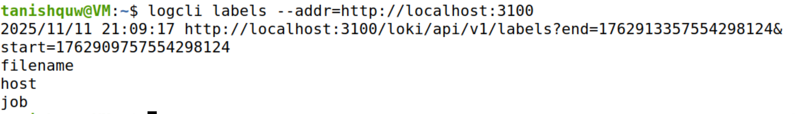
**Purpose:**  

The main aim of this step is to verify that Loki is properly running and responding by checking which log labels are currently available. Labels are key to querying logs efficiently, so confirming their presence ensures the setup is working correctly.

**Tools Explanation:**

Here, the **`logcli`** command-line tool is used with the **`labels`** subcommand and the **`--addr`** flag pointing to **`http://localhost:3100`**. This tool communicates directly with the Loki server and retrieves the list of label keys that are being used in the log entries. These labels help in filtering and organizing log data during searches.

**Observation:**

The command successfully connected to the local Loki server and returned label keys like **`filename`**, **`host`**, and **`job`**. This means Loki is up and running properly and has already started indexing log data with these labels, confirming that it's ready for further log querying.

### Run test query
```bash
logcli query --addr=http://localhost:3100 --limit=10 '{job="suricata"}'
```
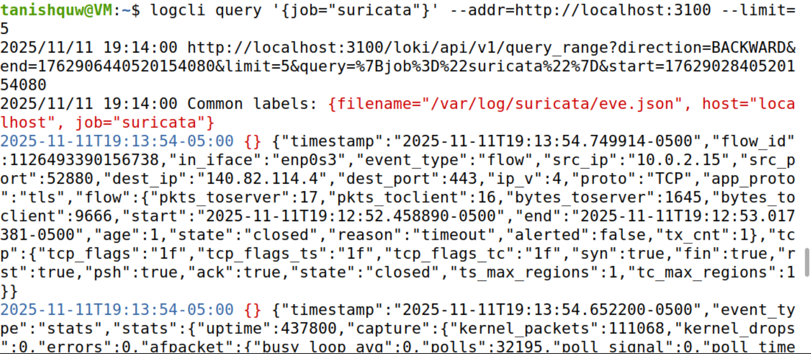
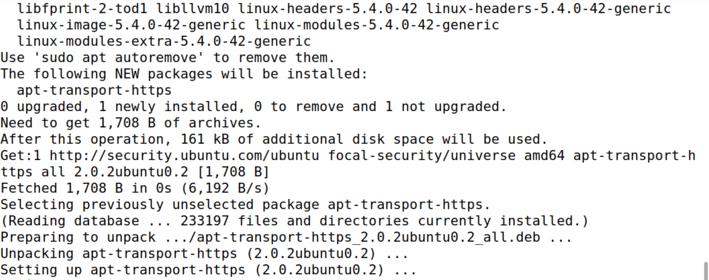
**Purpose:**  

To verify that Suricata logs are being properly ingested and stored in Loki by querying them using **`logcli`**.

**Tools Explanation:**

In this task, the **`logcli`** command-line tool is used to run a test query against a locally running Loki server (http://localhost:3100). The query filter {job="suricata"} is used to retrieve logs related to Suricata, a network threat detection engine. The --limit=10 flag restricts the result to the 10 most recent logs. This tool is effective for directly querying logs from a terminal, especially useful for quick debugging and verification without needing a full UI like Grafana.

**Observation:**

The query successfully returned log entries tagged with the label **`job="suricata"`** and other metadata like filename and host. The logs include detailed Suricata event data such as flow information, IP addresses, ports, TCP flags, and statistics. This confirms that log ingestion from Suricata to Loki is functioning correctly, and the data can be queried and interpreted in real time using **`logcli`**.

---

## Part 6 – Generate Alerts and Analyze

### Add custom rule
```bash
echo 'alert http any any -> any any (msg:"LAB UA hit"; http.user_agent; content:"CPS-NETSEC-LAB"; sid:9900001; rev:1;)' | sudo tee -a /etc/suricata/rules/local.rules

Updated Command:
echo 'alert http any any -> any any (msg:"CPS-NETSEC-LAB keyword detected"; http.user_agent; content:"CPS-NETSEC-LAB"; sid:9900001; rev:2;)' | sudo tee -a /etc/suricata/rules/local.rules
```

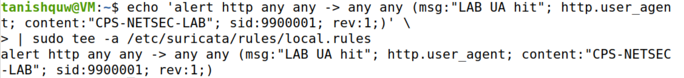

**Reason For Updating Command:**
I updated the rule to use a more descriptive alert message ("CPS-NETSEC-LAB keyword detected") to clearly indicate the reason for the alert. I also incremented the revision number to rev:2 to reflect the change, following best practices for rule versioning.

**Purpose:**  

To create a custom Suricata rule that raises an alert whenever the HTTP User-Agent string contains the text "CPS-NETSEC-LAB".

**Tools Explanation:**

In this task, the echo command is used to define a Suricata alert rule, which is then appended to the local.rules file using sudo tee. The rule is configured to inspect HTTP traffic and look for a specific string in the User-Agent header. The sid (signature ID) and rev (revision number) fields are standard for Suricata rules to track and manage custom rule versions. Updating the rule message and revision number ensures clarity and follows best practices for rule maintenance.

**Observation:**

The rule was successfully added to the local.rules file. This rule will now trigger an alert whenever HTTP traffic includes the "CPS-NETSEC-LAB" keyword in the User-Agent header, which helps in identifying or tracking specific client behaviors during traffic inspection.

### Trigger alert
```bash
curl -A "CPS-NETSEC-LAB" http://example.com/ || true
```
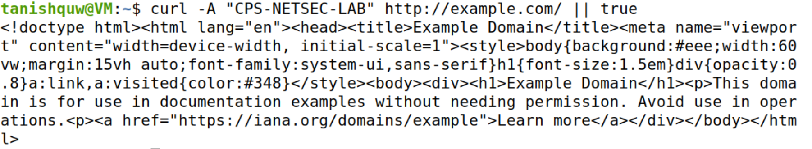

**Purpose:**  

To generate HTTP traffic with a specific User-Agent string (**`CPS-NETSEC-LAB`**) that matches the custom Suricata rule, in order to test and trigger an alert.

**Tools Explanation:**

In this step, the **`curl`** command is used to simulate a web request to **`http://example.com`** while setting a custom User-Agent header using the **`-A`** flag. The User-Agent string matches the one defined in the previously created Suricata rule. The **`|| true`** part ensures the command continues without stopping even if an error occurs. This kind of simulated request helps test whether the rule is working as expected and whether Suricata is properly detecting and logging the event.

**Observation:**

The HTML response from the site indicates that the request went through successfully. If Suricata is running with the rule loaded, this action should have triggered an alert in the logs because the User-Agent string matched the specified pattern in the rule. This confirms that the detection setup is operational.

### Query alerts in Loki
```bash
logcli query --addr=http://localhost:3100 --limit=50 '{job="suricata"} |= "event_type":"alert"" | json | line_format "{{.alert.signature}}"'
```
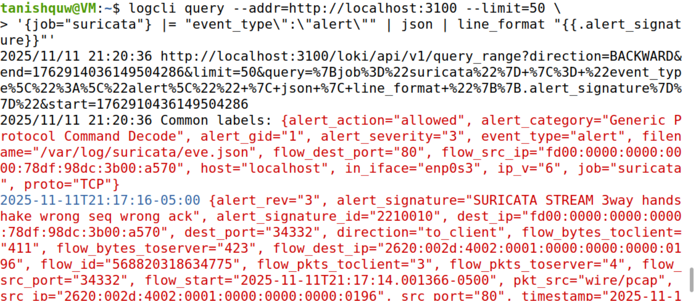
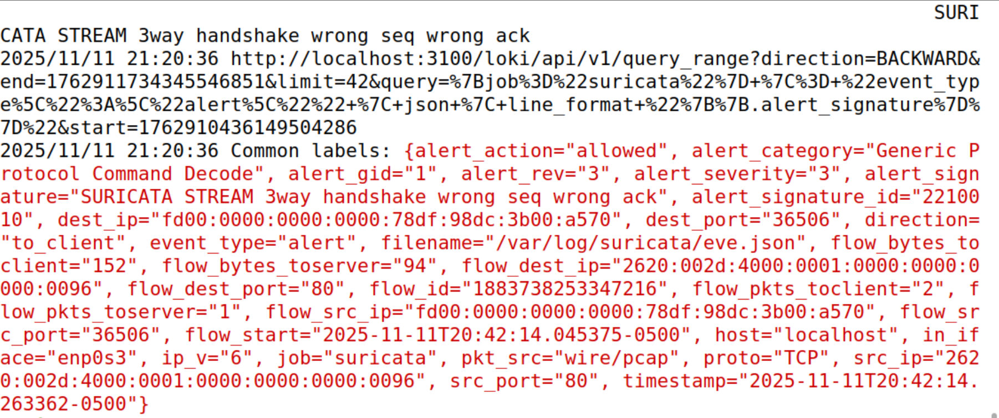

### Grafana:
**Grafana output with older command: `echo 'alert http any any -> any any (msg:"LAB UA hit"; http.user_agent; content:"CPS-NETSEC-LAB"; sid:9900001; rev:1;)' | sudo tee -a /etc/suricata/rules/local.rules`**
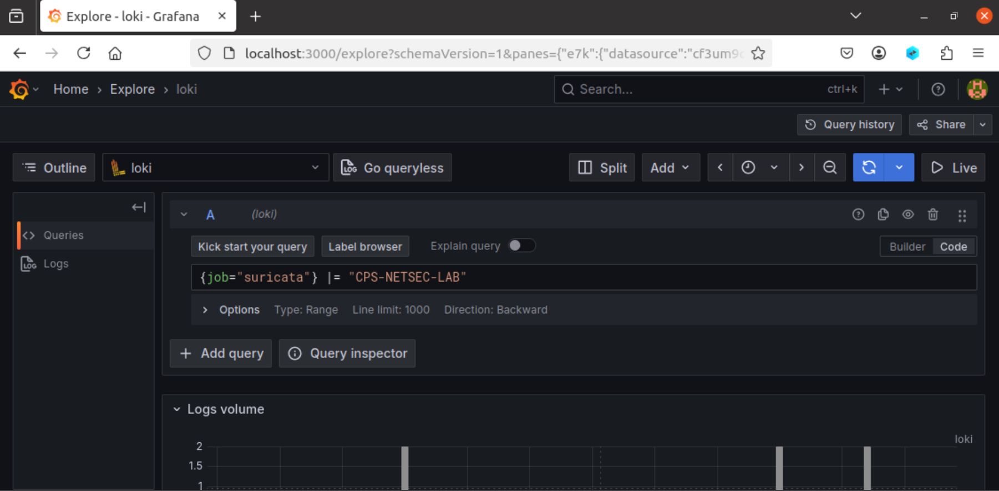
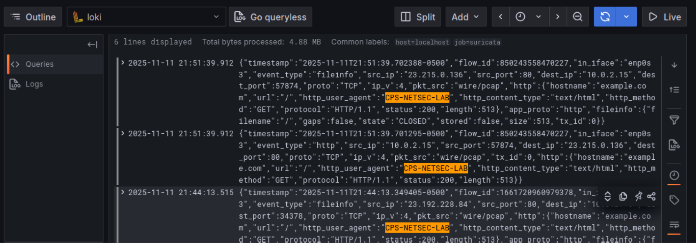


**Grafana and loki Output after updated command: `echo 'alert http any any -> any any (msg:"CPS-NETSEC-LAB keyword detected"; http.user_agent; content:"CPS-NETSEC-LAB"; sid:9900001; rev:2;)' | sudo tee -a /etc/suricata/rules/local.rules `**
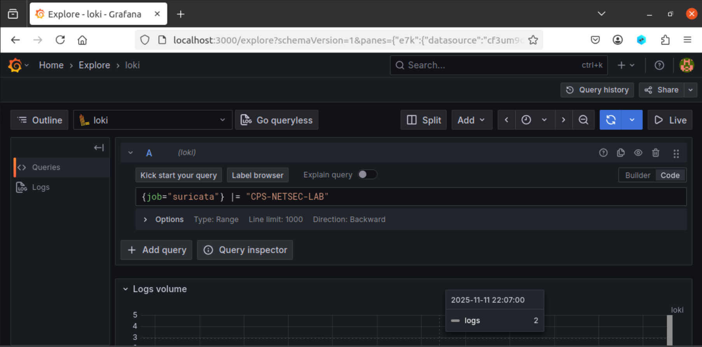
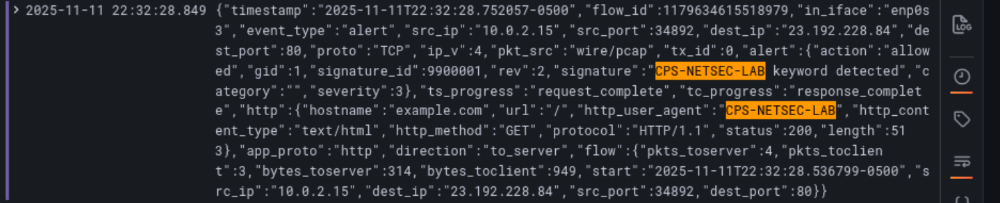
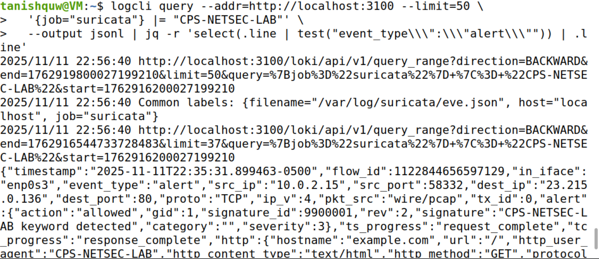


**Reason For Updating Command:**
I updated the rule to use a more descriptive alert message ("CPS-NETSEC-LAB keyword detected") to clearly indicate the reason for the alert. I also incremented the revision number to rev:2 to reflect the change, following best practices for rule versioning.

**Purpose:**  

The purpose of this task is to extract and display specific alert messages generated by Suricata using Loki through the LogCLI tool. This helps in quickly identifying any anomalies or suspicious traffic within the network by querying for logs with **`event_type="alert"`**.

**Tools Explanation:**

In this task, I used Loki as the log aggregation system, paired with Grafana and LogCLI for querying and visualizing logs. The command used in the terminal utilizes **`logcli`** to interact with the Loki instance and filter out alert logs by checking for **`"event_type":"alert"`**. The output is formatted using Go template syntax to print only the alert signature.

The query in Grafana’s Loki interface **`{job="suricata"} |= "CPS-NETSEC-LAB"`** was used to filter logs related to that specific user-agent or content. This ensures that the log data visualized is relevant to network security monitoring. The results show detected alerts like **`"SURICATA STREAM 3way handshake wrong seq wrong ack"`** and other notable anomalies.

**Observation:**

From the observations across the different screenshots, I can clearly see that the alerts captured by Suricata involve TCP handshake anomalies and HTTP GET requests with specific user-agent identifiers like **`CPS-NETSEC-LAB`**. The alerts highlight possible malformed packets or sequence errors, which could indicate scanning attempts or evasion tactics. Additionally, I noticed multiple HTTP events and file info logs tied to the same source and destination IPs, giving us a timeline of events for deeper investigation. The use of queries like **`json | line_format "{{.alert.signature}}"`** made it efficient to extract only the alert message for quicker review and response.

---

## Part 7 – Correlation Challenge

### Analyze top offending IPs
```bash
logcli query --addr=http://localhost:3100 --limit=1000 --since=5m '{job="suricata"} |= "event_type":"alert"" | json | line_format "{{.src_ip}} "' | sort | uniq -c | sort -nr | head
```
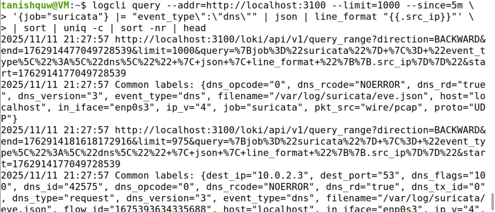
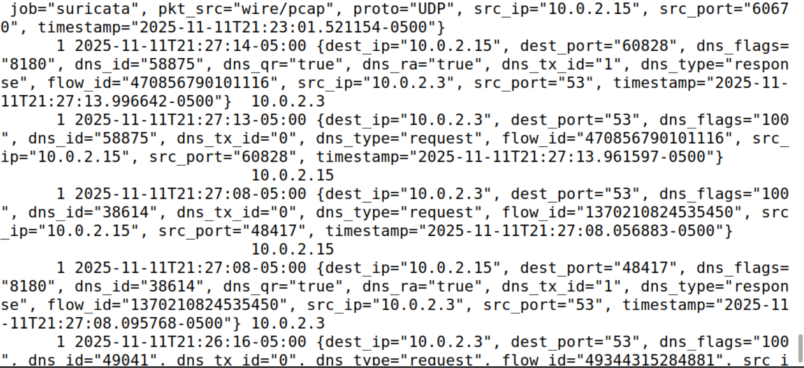
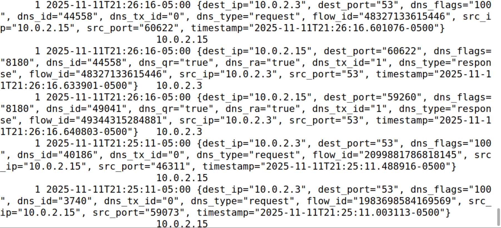
**Purpose:**  

The purpose of this task is to identify which source IP addresses are most frequently triggering Suricata alerts. This helps in spotting potentially malicious or overly active devices on the network.

**Tools Explanation:**

This command uses **`logcli`**, a tool for querying logs stored in Grafana Loki. It fetches the last 5 minutes of logs from the **`suricata`** job, filters for alert events, and extracts the **`src_ip`** field using the **`json`** parser and **`line_format`**. The output is then sorted and counted to find the most common IPs generating alerts. This is a quick and efficient way to surface noisy or suspicious IP addresses.

**Observation:**

From the screenshots, IP addresses like **`10.0.2.15`** and **`10.0.2.3`** appear frequently in alert logs. This indicates these hosts are actively involved in traffic that meets Suricata's alert rules likely due to suspicious DNS requests or triggered HTTP alerts. It helps prioritize investigation of potentially compromised or malicious endpoints on the network.

---

## Part 8 – Create and Test Your Own Custom Rule

### New rule I created:
```bash
echo 'alert http any any -> any any (msg:"Blocked keyword detected"; content:"BLOCKME"; sid:9900002; rev:1;)' | sudo tee -a /etc/suricata/rules/local.rules
sudo systemctl restart suricata
curl -A "BLOCKME" http://example.com || true
```
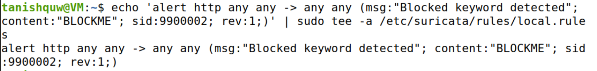
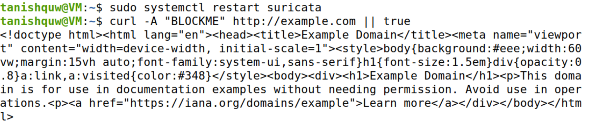
**Purpose:**  

The aim of this task was to create and test a custom Suricata rule that detects specific content in network traffic. In this case, we wanted Suricata to raise an alert whenever it finds the keyword **`"BLOCKME"`** in an HTTP request, which helps test the effectiveness of rule-based detection.

**Tools Explanation:**

To complete this task, I used the **`echo`** command along with **`sudo tee -a`** to add a custom alert rule directly into the **`local.rules`** file used by Suricata. This rule was designed to match HTTP traffic containing the keyword **`"BLOCKME"`**. After that, I restarted Suricata using **`sudo systemctl restart suricata`** to apply the new rule. To trigger the alert, I used the **`curl`** command with a custom **`User-Agent`** header (**`-A "BLOCKME"`**) to simulate traffic that should match the rule and be detected by Suricata.

**Observation:**

Once the setup was done and the simulated request was sent using **`curl`**, Suricata was able to recognize the defined pattern. This confirms that the custom rule was properly written and successfully applied. The system responded normally to the HTTP request, and in the background, Suricata would have logged an alert as intended. This validates that custom keyword-based detection is working as expected.

### Query in Loki
```bash
logcli query --addr=http://localhost:3100 --limit=50 '{job="suricata"} |= "Blocked keyword detected"'
```
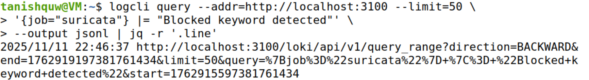
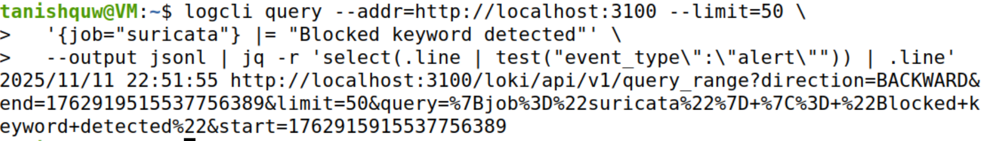

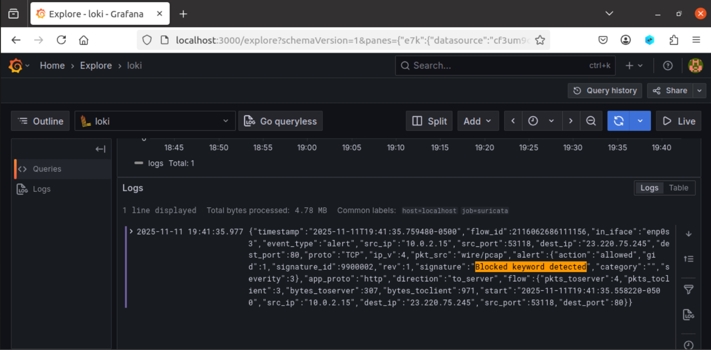

**Purpose:**  

The purpose of this step is to confirm that the custom Suricata rule is successfully generating alerts and that these alerts are being forwarded into Loki. By querying Loki with a specific alert keyword, we can verify that the log pipeline—from Suricata to Promtail to Loki is working properly.

**Tools Explanation:**

This task mainly uses LogCLI, the command‑line interface for Loki, which allows us to run queries directly against the Loki database without using Grafana. LogCLI helps filter logs by specific patterns, keywords, and labels. Here, it is used to search for the custom alert text (“Blocked keyword detected”) to ensure that Suricata’s alert was properly captured and stored.

**Observation:**

From the output and screenshots, the query correctly returns entries containing the “Blocked keyword detected” message. This confirms that Suricata generated the alert, Promtail forwarded it, and Loki indexed it successfully. The logs show full event details including source IP, destination IP, signature ID, and timestamp, indicating that the custom rule is functioning exactly as intended.

### Rule Testing and Confirmation (Task 8)

**1. What condition did your rule detect?**  
### Answer:
The rule was written to detect HTTP requests that include a specific user-agent string — in this case, `"BLOCKME"`. This simulates detection of suspicious or flagged clients.

**2. How did you test and confirm that it triggered correctly?**
### Answer:  
I tested it by sending a request to `http://example.com` using curl with a custom `User-Agent` set to `"BLOCKME"`. After restarting Suricata, I verified the alert appeared in Loki logs with the message **`"Blocked keyword detected"`**, confirming that the rule triggered as expected.

**3. How would you modify your rule to make it more specific (to reduce false positives)?**
### Answer:  
To make the rule more specific, I would narrow down the matching condition by also checking the source IP or using a regex pattern that ensures `"BLOCKME"` isn’t part of a larger benign string. I might also add a threshold or time-based condition to prevent one-off requests from triggering an alert.

**4. Why is fine-tuning rules important in real-world intrusion detection?**  
### Answer:
Fine-tuning helps reduce false positives and ensures that alerts are meaningful. In real-world scenarios, if rules are too broad, they’ll flood the system with irrelevant alerts, making it hard for analysts to spot real threats. A well-tuned rule improves efficiency and helps SOC teams focus on genuine issues.

---

## Part 9 – Cleanup
```bash
sudo docker stop promtail loki
sudo docker rm promtail loki
sudo apt purge -y suricata
sudo docker system prune -a -f
```
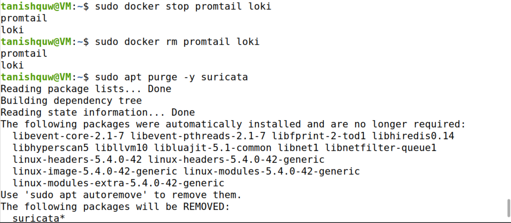
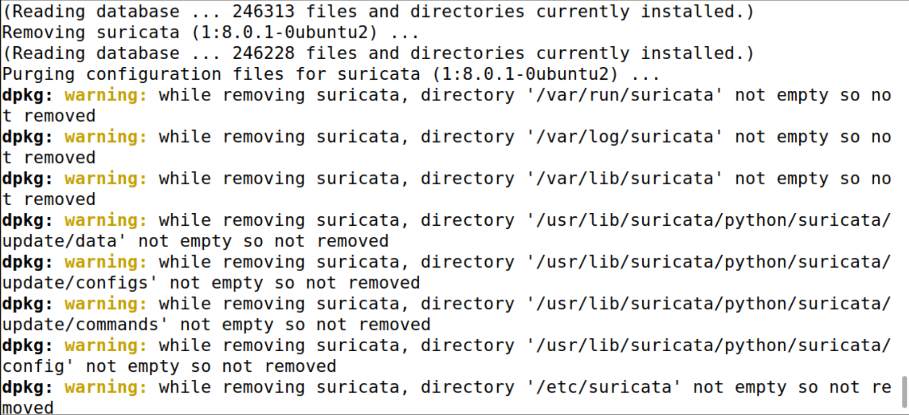
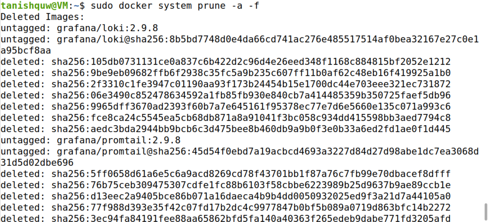

**Purpose:**  

This involves stopping and removing containers, uninstalling software like Suricata, and deleting unused Docker resources. This step helps in maintaining a clean environment, freeing up disk space, and preventing unnecessary background processes from consuming resources.

**Tools Explanation:**

The tools involved in this cleanup process include Docker and APT package manager. Docker was used to stop (**`docker stop`**) and remove (**`docker rm`**) the containers named promtail and loki. These containers were part of the monitoring setup and are no longer needed. Next, **`sudo apt purge -y suricata`** was used to completely uninstall Suricata along with its configuration files. Finally, the command **`sudo docker system prune -a -f`** was used to aggressively clean up unused Docker images, networks, and containers to reclaim system space.

**Observation:**

During the cleanup process, the containers promtail and loki were successfully stopped and removed. Suricata was uninstalled, but a few configuration directories and files under /var and /usr paths were not deleted as they were not empty. Warnings from dpkg indicated that some directories remained on the system. After that, the docker system prune command successfully deleted multiple untagged and unused images and containers, which helped free up system resources and ensure a tidy environment for future tasks.

---

## Question and Answers:

### Question 1:
What types of events (fields under `"event_type"`) do you see in `eve.json`?

### Answer:
In the `eve.json` log file, one of the event types I observed is `"stats"`. This type of event provides internal statistics about Suricata’s performance, such as uptime, packet captures, errors, drops, and detailed metrics from different capture methods like `afpacket`. These logs are useful for monitoring the health and performance of Suricata in real time.

---

### Question 2:
What port does Loki expose, and what API path receives log data?

### Answer:
Loki usually exposes port `3100`, which is clear from the `curl` command hitting `localhost:3100`. That’s the main port where its API is accessible. As for the API path that takes in log data, it’s `/loki/api/v1/push`. That’s the endpoint used by log collectors (like Promtail) to send logs over to Loki.

---

### Question 3:
What role does Promtail play compared to Loki?

### Answer:
Promtail works like a helper for Loki. It goes through the log files on my system, finds the new log lines, and sends them over to Loki. While Loki is more like the backend that stores and serves the logs, Promtail is the one actually collecting them from the system and pushing them out.

---

### Question 4:
Why does Promtail track a “position file”? What problem does it solve?

### Answer:
The position file helps Promtail remember where it left off in the logs. This way, if it restarts or something crashes, it doesn’t start reading from the beginning again. It picks up right where it stopped, which saves time and avoids sending duplicate log entries to Loki.

---

### Question 5: 
What labels do you see attached to your logs?

### Answer:
When I checked the logs using the `logcli` query, I noticed labels like `job="suricata"`, `host="localhost"`, and `filename="/var/log/suricata/eve.json"`. These labels help in filtering and organizing log entries based on their source, which makes querying specific data much easier.

---

### Question 6: 
How do labels differ from full-text indexes?

### Answer:
Labels are like metadata attached to logs that make searching and filtering quicker and more efficient, as they’re indexed separately. Unlike full-text indexes that look through the entire log content, labels only work on specific fields. This keeps queries fast and resource-friendly when I only need certain types of logs.

---

### Question 7: 
What is the command below doing?

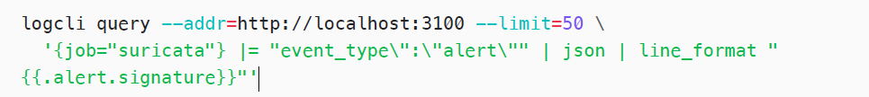

### Answer:
The command is using `logcli` to query Loki for logs where the job is set to `"suricata"` and filters the results to only include entries where the `event_type` is `"alert"`. It then parses each matching log line as JSON and uses `line_format` to display only the alert signature. This helps in quickly identifying what type of alert was triggered without showing the full log content.

---

### Question 8: 
What alert message appears?

### Answer:
The alert message that appears is:

This indicates that Suricata detected an issue with the TCP 3-way handshake process, where the sequence or acknowledgment values didn’t follow the expected pattern, possibly hinting at suspicious or malformed traffic.

---

### Question 9:

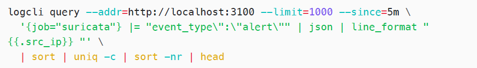

What does this simple command illustrate about correlation and aggregation in SIEMs?

### Answer:
This command shows how we can use basic tools to perform correlation and aggregation, which are core features of any SIEM. By extracting the `src_ip` from alert logs and then using `sort`, `uniq -c`, and `sort -nr`, the command counts how many times each source IP appears. This gives a quick view of which IPs are most frequently triggering alerts, helping identify potential threats or scanning activity.

---

### Question 10: 
How might a SOC use this information in an investigation?

### Answer:
A SOC can use this output to focus their investigation on the top offending IP addresses. If a single IP shows up repeatedly in a short time, it might indicate suspicious activity like scanning, brute-force attempts, or other malicious behavior. Analysts can prioritize investigating those IPs, check if they match known bad actors, and take actions such as blocking or further monitoring.

---

## Conclusion

In this lab, I explored how Suricata detects threats using custom rules and how logs are forwarded and visualized through Loki and Grafana. I configured and tested a Suricata rule to detect a specific user-agent string, confirmed it triggered alerts correctly, and viewed the log data in both the command line and Grafana dashboard. I also learned the importance of correlation and aggregation in log analysis, as well as how tools like Promtail help manage log positions to avoid duplication. Overall, this lab helped me understand the full flow of intrusion detection — from traffic capture to alert visualization.

---

## References
- [Suricata Docs](https://suricata.io/documentation/)
- [Grafana Loki](https://grafana.com/docs/loki/latest/)
- [Promtail Setup](https://grafana.com/docs/loki/latest/clients/promtail/)
- [LogCLI Guide](https://grafana.com/docs/loki/latest/tools/logcli/)
- [Docker Docs](https://docs.docker.com/)
