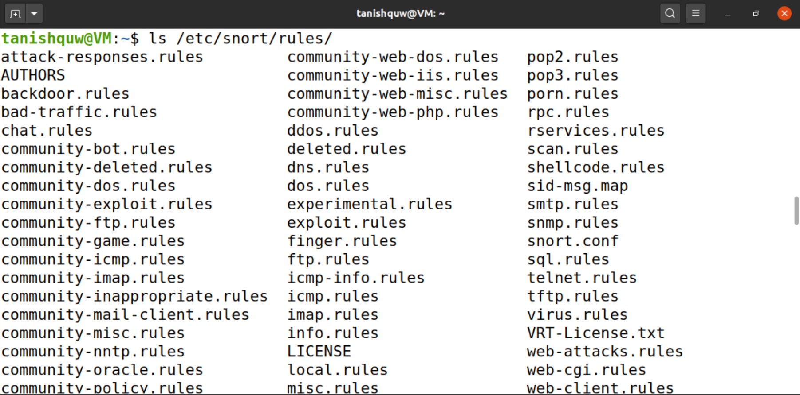
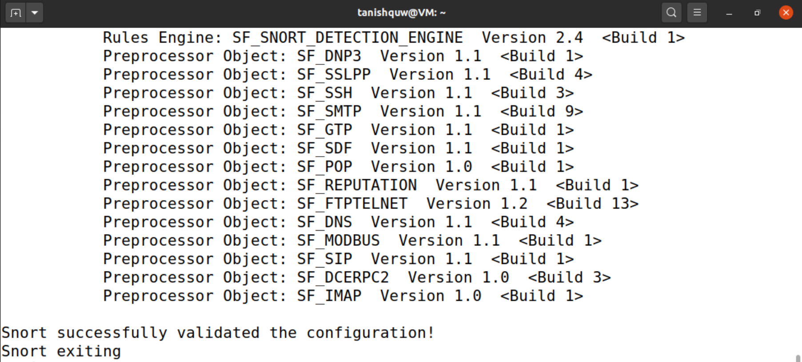

# Snort Installation and Configuration  

This document is part of my **Network Security Home Lab** series.  
Here, I document the installation, configuration, and testing of **Snort**, a popular open-source Intrusion Detection System (IDS), on an Ubuntu virtual machine.  

---

## Steps Covered  
## 1. Update the System  
**Commands used:**  
```bash
sudo apt update
sudo apt upgrade -y
```


### Purpose:  
Fetches the latest package lists from Ubuntu repositories so the newest Snort version and dependencies can be installed.

### Observation:  
I updated the system package list successfully using the above command. The update ran smoothly without any errors.
This ensured that all the latest repositories and dependencies were ready for installation.

---

## 2. Install Snort  
**Commands used:**  
```bash
sudo apt install snort -y
```


During installation, I was prompted for:  
- **Network Interface:**, `enp0s3`  
- **HOME_NET:**, `192.168.1.0/24`


To confirm the correct interface, I ran:  
```bash
ip a
```


### Purpose:  
Installs the Snort Intrusion Detection System (IDS) along with its required libraries.

### Observation:  
Snort installed successfully, and I verified my main interface (`enp0s3`) was active and used during configuration.

---

## 3. Configure Snort  
**Commands used:**  
```bash
sudo cat /etc/snort/snort.conf | less
```


### Purpose:  
Defines which network range Snort will treat as “home” and monitor for traffic.
In this step, I reviewed the configuration file but did not modify it.

### Observation:  
I opened the configuration file and found the HOME_NET variable already defined as any.
This means Snort is configured to monitor all available network traffic, which is ideal for testing purposes.
I did not make any modifications, as the default setup worked correctly. In a real-world environment, this value would be customized to match the actual local network range (for example, 10.0.2.0/24).

---

## 4. Update and Manage Rules  
**Commands used:**  
```bash
cd ~
sudo wget --no-check-certificate https://www.snort.org/downloads/community/community-rules.tar.gz
sudo tar -xvzf community-rules.tar.gz
sudo cp community-rules/* /etc/snort/rules/

```


To create a custom rule:  
```bash
sudo nano /etc/snort/rules/local.rules
```
Added the following rule:  
```
alert icmp any any -> any any (msg:"ICMP detected"; sid:1000001; rev:1;)
```


Checked if custom-made rule is added:
```bash
ls /etc/snort/rules/
```



### Purpose:  
Snort rules define the conditions under which alerts are triggered. The community rules detect known threats, while local rules can detect custom activity (like ping/ICMP).

### Observation:  
When I checked the /etc/snort/rules folder, I could see the existing rule files like local.rules and others that come by default.

To get the latest community rules, I used the wget command with the --no-check-certificate option, since there were SSL certificate issues when trying to download directly from the Snort site.

The downloaded archive community-rules.tar.gz was successfully extracted into /etc/snort/rules/.

After extracting the file, I verified the rules using Snort’s test command (-T). It showed that all rules were loaded successfully without any errors.

The local.rules file was reviewed and confirmed editable for adding custom detection rules in the future.

### **Question:**
Which rules stick out to you? What is the purpose of rules in general?

### **Answer:**
When I checked the /etc/snort/rules directory, a few rule files caught my attention such as community-scan.rules, community-telnet.rules, and community-virus.rules. These stood out because they detect different types of suspicious activity like port scanning, unauthorized login attempts, and malware communication on the network.

The purpose of rules in general is to tell Snort what kind of network traffic to monitor and alert for. Each rule acts like a condition that triggers an alert when certain patterns or behaviors are detected in the packets. Basically, rules are what make Snort intelligent — they help it detect intrusions, attacks, and unusual activities happening in the network.

---

## 5. Test Snort Configuration  
**Commands used:**  
```bash
sudo snort -T -c /etc/snort/snort.conf
```



### Purpose:  
Validates Snort’s configuration and rules before running in IDS mode.

### Observation:  
I ran the test command to check if Snort was configured properly.
The output showed that the configuration was successfully validated and that all rule files loaded without any errors.
It also displayed the message “Snort successfully validated the configuration!”, confirming everything was set up correctly.

---

## 6. Running Snort in IDS Mode  
**Commands used:**  
```bash
sudo snort -c /etc/snort/snort.conf -i enp0s3
ping -c 3 8.8.8.8
```


### Purpose:  
Starts Snort in live Intrusion Detection mode to monitor and log network activity.

### Observation:  
I started Snort in logging mode and then sent a few ping packets to 8.8.8.8 to generate traffic.
Snort captured the packets and stored them inside the /var/log/snort directory.
When I checked the folder afterward, new log files were created successfully.
This confirmed that Snort was recording live network packets properly for later review.

---

## 7. View Snort Logs  
**Commands used:**  
```bash
sudo cat /var/log/snort/snort.log
sudo ls -l /var/log/snort
sudo snort -r /var/log/snort/snort.log
```


### Purpose:  
Review Snort’s alerts and log files to verify detection activity.

### Observation:  
When I listed the log directory, I found two log files: snort.log and another with a timestamp.
Viewing them with cat showed binary text, confirming Snort was logging raw packets.
Then I used the sudo snort -r command to read the log file in a readable format. This allowed me to see decoded packet details such as IP headers and protocol information.
It proved that Snort not only captured the data but could also analyze and interpret it effectively.

### **Question:**
What files did you find in /var/log/snort/? Do they contain any content? Why or why not?

### **Answer:**
When I checked the /var/log/snort/ directory, I found two log files — one named snort.log and another one with a timestamp. When I opened them using the cat command, the content appeared as binary text, which means Snort was saving the raw packet data it captured from the network. To view the information properly,

I used the command:
```bash
sudo snort -r /var/log/snort/snort.log
```
The files looked unreadable in plain text because Snort stores its captured traffic in binary format, which is meant to be analyzed by Snort or other packet analysis tools later. This confirmed that Snort was successfully capturing and logging live network traffic for further inspection.

---

## 8. Run Snort as a Daemon  
**Commands used:**  
```bash
sudo snort -D -c /etc/snort/snort.conf -i enp0s3
```


### Purpose:  
Running Snort in daemon mode allows continuous background monitoring.

### Observation:  
When I ran the command, Snort started as a background service.
The output showed a message that a daemon child process had been created with its PID, and the parent process exited normally.
This confirmed that Snort was successfully running as a background service.
Running it this way allows Snort to monitor traffic continuously without keeping the terminal busy.

---

## 9. Monitor and Manage Snort Process  
**Commands used:** 
```bash
top
sudo kill 30034
```


### Purpose:
To check if Snort is actively running in the background after being started as a daemon, and to stop it manually when needed.

### Observation: 
After starting Snort in daemon mode, I used the top command to see the list of running processes.
Snort appeared in the list, running under the root user with a process ID (PID) of 30034.
This confirmed that Snort was successfully operating in the background.
When I wanted to stop it, I used the sudo kill 30034 command, which immediately terminated the Snort process.
After that, I checked again using top, and Snort was no longer listed, confirming it was stopped correctly.

### **Question:**
To see to the different processes running in your system, use the command top . If you wait a
few seconds, you should see Snort running. If you wanted to stop the Snort process from
running, what is the command to terminate it?

### **Answer:**
After running Snort in daemon mode, I used the top command to see the list of active processes on my system.
Snort appeared in the list, showing it was running under the root user with a specific process ID (PID).
This confirmed that Snort was successfully running in the background.

To stop it, I used the command:
```bash
sudo kill 30034
```
After that, I checked again using top, and Snort was no longer listed, which confirmed that the process was stopped correctly.
This method is a simple and effective way to monitor and manage Snort when it’s running as a background service.

### **Conclusion:** 
This lab helped me understand how Snort works as an intrusion detection system.
I learned how to install, configure, and update its rules, and also how to run it in different modes to monitor network activity.
Running Snort in console, logging, and daemon modes gave me practical experience in detecting and analyzing traffic.
Overall, the task improved my understanding of how IDS tools help in monitoring and securing a network.

---